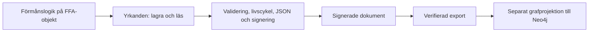

# FFA – en förvaltad informationsmodell

Den här arkitektur-PoC:en visar hur FFA:s informationsmodell kan bli en gemensam
Java-objektmodell med en förvaltad gräns för datahantering. Förmånssystemen arbetar
med yrkanden, producerade resultat och beslut. Den gemensamma implementationen
äger JSON-format, identitet, versionering, signering, verifiering och migrering.

Syftet är att flytta ansvaret för organisationsmodell och datahantering till en
gemensam förvaltning, så att förmånsteamen kan koncentrera sig på affärslogiken.
Förmånens egen utvidgning visas med hundens ras i det påhittade hundbidraget.

## Börja här

Du behöver JDK 25 och Maven. Kör från projektets rot:

```sh
mvn -q -Pdemo verify
```

Kommandot bygger projektet, kör testerna och startar demon på Java-modulernas
sökväg. Demon skapar ett yrkande med en ersättning och ett beslut, lagrar det,
läser tillbaka det och ändrar ersättningen. Resultatet blir:

```text
Yrkande: version 2, ersättning: version 2, beslut: version 1.
```

Det lagrade dokumentet är signerat. Demon exporterar ett verifierat JSON-underlag
till `target/demo-yrkande.json` för den separata grafdemonstrationen.
Minneslagret och de tillfälliga RSA-nycklarna skapas vid varje körning.

Läs sedan [förmånsexemplet](hundbidrag/src/main/java/se/fk/hundbidrag/Applikation.java),
[förmånens objekt-API](ffa-core/src/main/java/se/fk/mimer/api/Yrkanden.java) och
[den gemensamma implementationen](ffa-core/src/main/java/se/fk/mimer/runtime/ForvaltadeYrkanden.java).

## Vem ansvarar för vad?

| Del | Ansvar |
| --- | --- |
| `hundbidrag` | Förmånslogik ovanpå FFA:s modell och en liten förmånsutvidgning |
| `ffa-core` | Organisationsmodell, gemensamma strukturkrav och förvaltad datahantering |
| `ffa-demo` | Koppla ihop förmånen med lagringsadapter och betrodda nycklar |
| `ffa-graph` | Härleda en sökbar graf från den förvaltade representationen |



Förmånen får ett `Yrkanden<YrkandeOmHundbidrag>` när applikationen skapas.
Det offentliga API:et har två operationer:

```java
yrkande = yrkanden.las(id);
yrkande.addProduceratResultat(ersattning);
yrkande.setBeslut(beslut);
yrkande = yrkanden.lagra(yrkande);
```

`lagra` returnerar ett fristående objekt med de lagrade versionerna. Använd det
returnerade objektet vid fortsatt handläggning. Det inlämnade objektet ändras
inte av datahanteringen, även om lagringen misslyckas.

Förmånen får inga JSON-strängar, lagringsadaptrar, mappers eller
signeringsinställningar genom detta API. Java-moduler gör gränsen kontrollerbar:
`hundbidrag` läser enbart `se.fk.ffa.core`. Kärnan exporterar modellen,
modellannoteringarna och objekt-API:et. Infrastrukturpaketet exporteras endast
till demomodulen. Jackson får riktad reflektionsåtkomst till modellpaketen.
Identitet och version kan läsas med `getId()` och `getVersion()`; deras
ändringsmekanismer är interna.

Detta är en arkitekturgräns för kod som byggs och körs som Java-moduler. Att lägga
allt på klassökvägen eller uttryckligen öppna moduler förändrar gränsen.

## Vad händer vid lagring och återläsning?

Vid lagring kontrolleras modellens gemensamma struktur och den senast lagrade
versionen. Infrastrukturen skapar en arbetskopia och upptäcker ändrade
livscykelobjekt genom stabila kontrollsummor. Nya objekt får version 1; ändrade
objekt får nästa version; oförändrade objekt behåller sin version.

Arbetskopian serialiseras till JSON med aktuell formatversion. Dokumentet
signeras enligt en gemensam policy: JCS-kanonisering och RSA-PSS med SHA-512.
Den färdiga representationen verifieras och valideras innan den lämnas till
lagringsadaptern. Först efter lyckad lagring returneras det nya tillståndet.

Vid återläsning verifieras det ursprungliga dokumentet mot en nyckel som
infrastrukturen redan litar på. Därefter kontrolleras dokumenttyp och
formatversion, äldre format migreras, och JSON binds till den aktuella
Java-modellen. Modellens struktur och dokumentets identitet kontrolleras innan
förmånen får objektet. En signatur ersätter alltså inte modellvalidering.

Objektets `version` beskriver dess innehåll. Dokumentets `mimer:schemaVersion`
beskriver JSON-formatet. Ett rent formatbyte behöver inte öka objektversionerna.
`__attention` markerar nya eller ändrade objekt i den skrivna representationen;
förmånskoden hanterar inte flaggan.

Den enda migreringen i huvudexemplet byter det äldre namnet
`producerade_resultat` till `producerat_resultat`. Dokument utan formatversion
räknas som format 0; nya dokument skrivs som format 1. Okända formatversioner och
tvetydiga fältnamn avvisas. Migrering ändrar inte det ursprungliga signerade
dokumentet i lagret. Nästa lagring skriver den aktuella representationen.

## Den separata grafdemonstrationen

```sh
mvn -q -Pdemo,graph verify
```

Detta kör först objektflödet och skapar därefter `target/demo-graph.cypher`.
Grafmodulen har inget beroende på förmånsmodulen. Den läser den verifierade
exporten och en [central grafmappning](ffa-graph/src/main/resources/graph-mapping.json).

I det lilla exemplet blir yrkande, beslut och ersättning noder med samma
identiteter som i objektmodellen. Inbäddningen ger relationerna `BESLUT` och
`PRODUCERAT_RESULTAT`. Belopp och period plattas ut till nodegenskaper.
Mappningen väljer vilka egenskaper som blir sökbara; personnummer och hundras
projiceras inte i exemplet. Okända nodtyper avvisas tills en mappning finns.

Cypher-filen kan granskas och köras i en separat Neo4j-databas. Verktyget ansluter
inte till Neo4j. Det visar objektens motsvarigheter i grafen och är inte en
fullständig synkronisering av ändringar eller borttagna relationer. Den lokala
JSON-exporten är redan verifierad av demon; grafverktyget tar inte emot och
verifierar signerade dokument från externa avsändare.

## Vad testerna visar

```sh
mvn -q test
```

Tester täcker lagring, återläsning, förmånsutvidgningen, versionsändringar,
oförändrat innehåll, manipulerade dokument, betrodda nycklar, kanonisering,
historiska format, modellvalidering, inaktuella versioner och lagringsfel.
Separata kompileringstester använder `javac` för att kontrollera att förmånskod
kan använda objekt-API:et men inte de interna paketen, Jackson direkt eller
livscykelns ändringsmekanismer. Profilen `graph` lägger även till graftesterna.

## Avgränsning och fortsättning

Detta är en PoC med ett minneslager, en konfigurerad nyckel och ett fåtal
gemensamma strukturkrav. Förmånsregler, exempelvis hur rätten bedöms eller
ersättningen beräknas, tillhör förmånen. De offentliga verksamhetsfälten är
fortfarande muterbara; den gemensamma gränsen kontrollerar tillståndet vid
lagring och återläsning. Modellen behöver fler förvaltade invariantregler inför
verklig användning.

Versionskontrollen skyddar mot inaktuella objekt inom en repository-instans.
En verklig lagringsadapter behöver atomisk versionskontroll mellan flera
klienter, samt definierad hantering av transaktioner och återförsök. Kopiering
av intern livscykelmetadata täcker yrkandet, dess beslut och producerade resultat;
utvidgningar med egna livscykelobjekt behöver en motsvarande central regel.

Nyckelrotation, certifikatbaserad tillit och produktionsintegration med Mimer
återstår. Dessa frågor ska lösas bakom objekt-API:et, så att förmånen kan behålla
samma arbetssätt.

Tidigare studier av JSON-LD, RDF, GraphQL, alternativa grafpipelines och
certifikathantering finns i [experiments](experiments/README.md).
