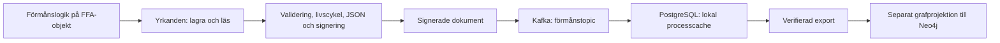

# FFA – en förvaltad informationsmodell

Den här arkitektur-PoC:en visar hur FFA:s informationsmodell kan bli en gemensam
Java-objektmodell med en förvaltad gräns för datahantering. Förmånssystemen arbetar
med yrkanden, producerade resultat och beslut. Den gemensamma implementationen
äger JSON-format, identitet, versionering, signering, verifiering och migrering.

Syftet är att flytta ansvaret för organisationsmodell och datahantering till en
gemensam förvaltning, så att förmånsteamen kan koncentrera sig på affärslogiken.
Förmånens egen utvidgning visas med hundens ras i det påhittade hundbidraget.

## Börja här

Du behöver JDK 25, Maven och Docker. Kör från projektets rot:

```sh
docker compose up -d --wait postgres kafka
docker compose run --rm topic
mvn -q -Pdemo verify
```

Kommandot bygger projektet, kör testerna och startar demon på Java-modulernas
sökväg. Demon skapar ett yrkande med en ersättning och ett beslut, lagrar det,
läser tillbaka det och ändrar ersättningen. Demon skriver ut process-id, senaste dataleverans-id och yrkandets version.
Samma process-id används för flera leveranser. En ny gränsinstans läser tillbaka
processens senaste lokala tillstånd, som vid en senare aktivitet i processmotorn.

Det lagrade dokumentet är signerat. Demon exporterar ett verifierat JSON-underlag
till `target/demo-yrkande.json` för den separata grafdemonstrationen.
Kafka är ingången till masterdataflödet. PostgreSQL lagrar en lokal historikcache
för processens återläsning. Utvecklingsnyckeln sparas i `.demo/nycklar`, utanför
Git och Maven:s `clean`, så att tidigare dokument kan verifieras efter omstart.

Lagringslägen, metadata, SQL-schema, felhantering och återförsök beskrivs i
[Kafka och PostgreSQL](docs/persistens.md).

Läs sedan [förmånsexemplet](hundbidrag/src/main/java/se/fk/hundbidrag/Applikation.java),
[förmånens objekt-API](ffa-core/src/main/java/se/fk/mimer/api/Yrkanden.java) och
[den gemensamma implementationen](ffa-core/src/main/java/se/fk/mimer/runtime/ForvaltadeYrkanden.java).

## Vem ansvarar för vad?

| Del | Ansvar |
| --- | --- |
| `hundbidrag` | Förmånslogik ovanpå FFA:s modell och en liten förmånsutvidgning |
| `ffa-core` | Organisationsmodell, gemensamma strukturkrav och förvaltad datahantering |
| `ffa-persistence` | Kafka-leverans, PostgreSQL-cache, leveranshistorik och återförsök |
| `ffa-demo` | Koppla ihop förmånen med lagringsadapter och betrodda nycklar |
| `ffa-graph` | Härleda en sökbar graf från den förvaltade representationen |



Förmånen får ett `Yrkanden<YrkandeOmHundbidrag>` när applikationen skapas.
Processmotorn anger sitt process-id som korrelations-id vid lagring och återläsning:

```java
yrkande = yrkanden.lasProcess(processId);
yrkande.addProduceratResultat(ersattning);
yrkande.setBeslut(beslut);
yrkande = yrkanden.lagra(processId, yrkande);
```

`lagra` returnerar ett fristående objekt med de lagrade versionerna. Använd det
returnerade objektet vid fortsatt handläggning. Det inlämnade objektet ändras
inte av datahanteringen, även om lagringen misslyckas.

Förmånen får inga JSON-strängar, lagringsadaptrar, mappers eller
signeringsinställningar genom detta API. Java-moduler gör gränsen kontrollerbar:
`hundbidrag` läser enbart `se.fk.ffa.core`. Kärnan exporterar modellen,
modellannoteringarna och objekt-API:et. Infrastrukturpaketet exporteras endast
till demo- och persistensmodulerna. Jackson får riktad reflektionsåtkomst till modellpaketen.
Identitet och version kan läsas med `getId()` och `getVersion()`; deras
ändringsmekanismer är interna.

Detta är en arkitekturgräns för kod som byggs och körs som Java-moduler. Att lägga
allt på klassökvägen eller uttryckligen öppna moduler förändrar gränsen.

## Vad händer vid lagring och återläsning?

Vid lagring kontrolleras modellens gemensamma struktur och den senast lagrade
versionen. Infrastrukturen skapar en arbetskopia och upptäcker ändrade
livscykelobjekt genom stabila kontrollsummor. Nya objekt får version 1; ändrade
objekt får nästa version; oförändrade objekt behåller sin version.

Arbetskopian serialiseras till JSON med aktuell formatversion. Dokumentet
signeras enligt en gemensam policy: JCS-kanonisering och RSA-PSS med SHA-512.
Den färdiga representationen verifieras och valideras innan den lämnas till
lagringsadaptern. Först efter lyckad lagring returneras det nya tillståndet.

Vid återläsning verifieras det ursprungliga dokumentet mot en nyckel som
infrastrukturen redan litar på. Därefter kontrolleras dokumenttyp och
formatversion, äldre format migreras, och JSON binds till den aktuella
Java-modellen. Modellens struktur och dokumentets identitet kontrolleras innan
förmånen får objektet. En signatur ersätter alltså inte modellvalidering.

Objektets `version` beskriver dess innehåll. Dokumentets `mimer:schemaVersion`
beskriver JSON-formatet. Ett rent formatbyte behöver inte öka objektversionerna.
`__attention` markerar nya eller ändrade objekt i den skrivna representationen;
förmånskoden hanterar inte flaggan.

Migreringsmotorn är en central komponent i `ffa-core` och använder officiella
JsonPath 3.0.0 med Jackson 3-providers. Den arbetar på ett JSON-träd före
`treeToValue`, så historiska representationer behöver inte passa dagens
Java-klasser. Förmånen ser endast det färdigmigrerade och validerade objektet.

Den körbara demon lägger ett signerat dokument i format 0 i lagret och läser
det genom två ackumulerade steg:

1. **0 → 1:** byt `producerade_resultat` till `producerat_resultat` och gör
   ett enstaka resultat till en lista.
2. **1 → 2:** byt `belopp.summa` till `belopp.varde` i varje resultat.

Stegen registreras i [MimerMigrations](ffa-core/src/main/java/se/fk/mimer/migration/MimerMigrations.java).
Vid nästa formatändring läggs ett nytt steg till och `CURRENT` höjs; tidigare
steg behålls. Ett dokument i format 1 kör bara steg 1 → 2, medan ett dokument
i aktuellt format inte migreras. Dokument utan formatversion räknas som format 0.
Varje steg består av namngivna JSONPath-regler och kan kombinera flera urval och
transformationer. Egna mutatorer kan uttrycka mer komplexa ändringar.

Motorn kontrollerar kedjan före körning och avvisar saknade, tvetydiga eller
ogiltiga steg och okända formatversioner. Efter varje lyckat steg uppdateras
formatversionen och en granskningspost skapas; regelposter anger träffad sökväg
och utförd ändring. Granskningslistan returneras av motorn men lagras inte separat
i denna PoC. Om en regel misslyckas avbryts läsningen och arbetsdokumentet kasseras.

Migrering ändrar aldrig den ursprungliga signerade representationen i lagret.
Demon visar också nästa lagring: då skrivs format 2 med en ny signatur.
Objektens innehållsversioner behålls när endast JSON-formatet har ändrats.

## Den separata grafdemonstrationen

```sh
mvn -q -Pdemo,graph verify
```

Detta kör först objektflödet och skapar därefter `target/demo-graph.cypher`.
Grafmodulen har inget beroende på förmånsmodulen. Den läser den verifierade
exporten och en [central grafmappning](ffa-graph/src/main/resources/graph-mapping.json).

I det lilla exemplet blir yrkande, beslut och ersättning noder med samma
identiteter som i objektmodellen. Inbäddningen ger relationerna `BESLUT` och
`PRODUCERAT_RESULTAT`. Belopp och period plattas ut till nodegenskaper.
Mappningen väljer vilka egenskaper som blir sökbara; personnummer och hundras
projiceras inte i exemplet. Okända nodtyper avvisas tills en mappning finns.

Cypher-filen börjar med en unikhetsregel för `FfaObjekt.id`, följd av hela
projektionen som **en enda fråga**. Kör schemaregeln först och därefter hela
projektionsfrågan i en transaktion. Rotobjektet låses före versionskontrollen;
endast en högre objektversion får ändra grafen. Samma version och äldre tillstånd
lämnar den beständiga grafen oförändrad även vid samtidiga importförsök.

Ett accepterat tillstånd ersätter rotens egna projekterade relationer med de
relationer som finns i den kompletta snapshoten. Relationer märks med
`ffaProjectionOwner`; andra rotobjekts relationer berörs inte. Noder som inte längre
refereras behålls, eftersom automatisk nodradering kräver regler för ägarskap.
Även barnnodernas egenskaper skyddas av deras versioner. Exemplet utgår från att
rotens snapshot äger sina inbäddade relationer; delade objekt mellan processer
behöver ett förvaltat kontrakt för relationernas ägarskap.

Verktyget ansluter inte självt till Neo4j. Integrationssviten kör den genererade
frågan mot en separat lokal Neo4j och visar dubletter, äldre tillstånd och
borttagna relationer. Den lokala
JSON-exporten är redan verifierad av demon; grafverktyget tar inte emot och
verifierar signerade dokument från externa avsändare.

## Vad testerna visar

```sh
mvn -q test
```

Tester täcker lagring, återläsning, förmånsutvidgningen, versionsändringar,
oförändrat innehåll, manipulerade dokument, betrodda nycklar, kanonisering,
historiska format, modellvalidering, inaktuella versioner och lagringsfel.
Separata kompileringstester använder `javac` för att kontrollera att förmånskod
kan använda objekt-API:et men inte de interna paketen, Jackson direkt eller
livscykelns ändringsmekanismer. Profilen `graph` lägger även till graftesterna.
Vanliga tester behöver inte Docker. De använder ett delat minneslager under
`test-support/src/test/java`, som enbart kompileras som testkod och inte
paketeras i lösningens JAR-filer. Den körbara demon använder alltid Kafka och
PostgreSQL. För integrationstester, starta Docker och kör:

```sh
./scripts/test-integration.sh
```

Skriptet startar projektets Kafka, PostgreSQL och Neo4j, väntar på hälsokontrollerna,
skapar förmånstopicen och kör testerna inklusive grafmodulen. Tjänsterna lämnas
kvar efteråt; `docker compose stop` stoppar dem utan att radera volymerna.
Om tjänsterna redan är startade kan testerna också köras direkt med
`mvn -q -Pgraph -Dffa.integration=true test`.

De kontrollerar verklig Kafka/PostgreSQL, opaque JSON, metadata, processhistorik,
fel i båda lagringslägena, återförsök efter omstart och konkurrerande skribenter.

## Avgränsning och fortsättning

Detta är en PoC med Kafka och en lokal PostgreSQL-cache, en konfigurerad nyckel och ett fåtal
gemensamma strukturkrav. Förmånsregler, exempelvis hur rätten bedöms eller
ersättningen beräknas, tillhör förmånen. De offentliga verksamhetsfälten är
fortfarande muterbara; den gemensamma gränsen kontrollerar tillståndet vid
lagring och återläsning. Modellen behöver fler förvaltade invariantregler inför
verklig användning.

PostgreSQL-adaptern kontrollerar den förväntade objektversionen inom sin
transaktion, även mellan flera instanser. Rådgivande processlås bevarar ordningen
inom processen och objektlås skyddar identiteten. Oberoende processer kan skrivas
och återförsökas parallellt. Kafka och PostgreSQL delar
ingen atomisk transaktion; kvarvarande felgränser beskrivs i persistensdokumentet. Kopiering
av intern livscykelmetadata täcker yrkandet, dess beslut och producerade resultat;
utvidgningar med egna livscykelobjekt behöver en motsvarande central regel.

En valfri `Dokumentkalla` ger verifierad återställning från backend vid cachemiss,
utan ny Kafka-publicering. Företagets backendadapter behöver implementeras i den
miljö där backend är tillgänglig; se [persistenskontraktet](docs/persistens.md).
Utvecklingsnyckelns skapande skyddas av JVM- och fillås så att samtidiga demostarter
använder samma beständiga nyckel.

Nyckelrotation, certifikatbaserad tillit och produktionsintegration med Mimer
återstår. Dessa frågor ska lösas bakom objekt-API:et, så att förmånen kan behålla
samma arbetssätt.

Tidigare studier av JSON-LD, RDF, GraphQL, alternativa grafpipelines och
certifikathantering finns i [experiments](experiments/README.md).
