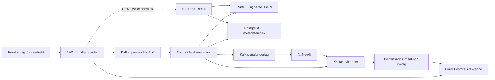

# Testa och demonstrera hela kedjan

Den valfria modulen `ffa-pipeline` kopplar samman N−2, N−1 och N med verkliga
lagringar. Förmånens vanliga bygge och objekt-API behöver fortfarande inte S3
eller Neo4j. Backend och grafkonsument är separata infrastrukturkomponenter.



## Kör hela testsviten

```sh
./scripts/test-integration.sh --pipeline
```

Skriptet startar Kafka, PostgreSQL, Neo4j och RustFS, väntar på deras
hälsokontroller och kör enhets-, integrations-, graf- och kedjetester.
Utan `--pipeline` körs den tidigare sviten utan RustFS. Tjänsterna lämnas kvar.
RustFS-versionen är låst till `rustfs/rustfs:1.0.1`, från projektets
[officiella release](https://github.com/rustfs/rustfs/releases/tag/1.0.1).
Hälsokontrollen använder den dokumenterade
[readiness-endpointen](https://docs.rustfs.com/en/operations/status-check).

Kedjetesterna använder egna topics, konsumentgrupper, objektidentiteter och
S3-buckets. De städar sina data efteråt. Den gemensamma utvecklingsmiljön och
andra demokörningars data tas inte bort.

## Kör en demonstration och inspektera data

Efter att tjänsterna startats:

```sh
mvn -q -Pgraph,pipeline,pipeline-demo test
```

Detta kör en separat hundbidragsprocess genom hela kedjan och skriver ut
bekräftade milstolpar per leverans. Vanliga enhetstester körs också; Docker-
integrationstester körs bara om deras uttryckliga testflaggor anges.
Demonstrationen lämnar cache, rådata, topics och graf kvar för inspektion.
Varje körning får egen process, egna topics och en ny demonyckel. Den offentliga
verifieringsnyckeln och söknycklarna finns i `target/pipeline-demo/<körnings-id>.json`;
den privata nyckeln sparas inte. Detta ersätter inte den vanliga demons
beständiga nyckelhantering eller företagets produktionsnycklar.

| Tjänst | Lokal åtkomst |
| --- | --- |
| PostgreSQL | `localhost:15432`, databas/användare `ffa` |
| Kafka | `localhost:19092` |
| RustFS S3 | `http://localhost:19000` |
| RustFS konsol | `http://localhost:19001/rustfs/console/` |
| Neo4j Bolt | `bolt://localhost:17687` |

RustFS-konsolens utvecklingsinloggning är `ffa-demo` / `ffa-demo-object-store`.
Objekten ligger i bucket `ffa-pipeline-demo`, med dataleverans-id som exakt
objektnyckel. JSON lagras oförändrat, utan envelope. Signatur och identiteter
finns som S3-metadata. Korrelations-id och objekt-id är Base64-kodade i dessa
HTTP-headers för att även bevara svenska tecken.

Den lokala processcachen och backendens index använder samma PostgreSQL-tjänst
i utveckling, men separata tabeller och separata transaktioner. Backendens
index ligger i schemat `ffa_backend`; JSON finns bara i RustFS, inte i indexet.
Exempel på inspektion:

```sh
docker compose exec postgres psql -U ffa -d ffa -c 'SELECT dataleverans_id, korrelations_id, objekt_version, kafka_publicerad, radata_lagrade_tid, grafbehandlad_tid FROM ffa_dataleverans ORDER BY ordning DESC LIMIT 10;'
docker compose exec postgres psql -U ffa -d ffa -c 'SELECT dataleverans_id, topic, korrelations_id, objekt_version FROM ffa_backend.dataleverans ORDER BY ordning DESC LIMIT 10;'
docker compose exec neo4j cypher-shell -u neo4j -p ffa-demo-password 'MATCH (n:Yrkande) RETURN n.id, n.version, n.beskrivning LIMIT 10;'
```

Stoppa vid behov tjänsterna med `docker compose stop`. Volymer och demodata
finns kvar. Båda Kafka-topics har en partition och en replika i denna miljö;
det är ett utvecklingsflöde utan produktionsredundans.

## Protokollet som faktiskt körs

**N−2:** Signerad JSON lagras lokalt före Kafka-commit. Strikt läge kräver båda
och pausar processen vid obekräftat utfall. Resilient läge kan fortsätta från
lokalt lagrat tillstånd medan publicering återförsöks. Se
[persistenskontraktet](persistens.md).

**N−1:** `Radatasteg` läser med `read_committed`, verifierar signaturen med en
konfigurerad betrodd nyckel och kontrollerar dokumentets id och version mot
metadata. `Radatalager` skriver först objektet med S3-villkoret
`If-None-Match: *`, sedan metadata i en PostgreSQL-transaktion. En befintlig
objektnyckel accepteras endast när JSON och hela leveransmetadata matchar.
Indexet accepterar samma upprepning men avvisar andra bindningar.
[S3: villkorad objektskrivning och metadata](https://docs.aws.amazon.com/java/api/latest/software/amazon/awssdk/services/s3/model/PutObjectRequest.html)

Först efter båda externa lagringarna publiceras oförändrat dokument och
metadata till grafens topic. Vidareleveransen och källans konsumerade offset
committas tillsammans i Kafka. PostgreSQL och RustFS deltar inte i den
Kafka-transaktionen. Misslyckas Kafka efter extern commit återbehandlas
originalleveransen; externa skrivningar tål då upprepning.

**N:** `Grafsteg` läser med `read_committed` och verifierar dokumentet före
projektion. Neo4j ändras i en versionsskyddad transaktion; först därefter
committas kvittot och Kafka-offseten i en Kafka-transaktion. Ett avbrott efter
Neo4j-commit men före Kafka-commit kan ge en upprepning som grafen accepterar
utan regression.

## REST-uppslag och återläsning

`BackendRestServer` exponerar följande GET-resurser. Serverinstansen är knuten
till en förmånstopic; den kan inte söka andra förmåners index.

| Resurs | Svar |
| --- | --- |
| `/v1/leveranser/{dataleverans-id}` | Ursprunglig signerad JSON för leveransen |
| `/v1/processer/{korrelations-id}/senaste` | Senaste version, därefter indexets lagringsordning |
| `/v1/objekt/{objekt-id}/senaste` | Samma urval per objekt |
| Ovanstående resurs med `/metadata` | Metadata från PostgreSQL-indexet utan S3-läsning |

Dokumentsvar har oförändrade JSON-bytes och headers `X-FFA-dataleverans-id`,
`X-FFA-korrelations-id`, `X-FFA-objekt-id`, `X-FFA-objekt-version`,
`X-FFA-forvantad-version`, `X-FFA-skapad`, `X-FFA-signatur` och
`X-FFA-signatur-algoritm` (`JCS+RSA-PSS-SHA512`). Korrelations-id och objekt-id
är Base64-kodad UTF-8, signaturen är Base64-kodade bytes. Söknycklar i URL:en
procentkodas som enskilda segment. Metadataresursen returnerar läsbara id:n,
version, topic, indexets lagringstid och JSON:s SHA-256.

**Metadatauppslag ensamt bekräftar inte rådatalagring.** Dokumentsvaret kräver
att både index och S3 innehåller rätt leverans samt att signaturen verifieras.
404 betyder att indexposten saknas; 503 betyder att lagret är otillgängligt
eller att underlaget inte kan verifieras, exempelvis ett saknat S3-objekt trots
befintlig indexpost. `RestDokumentkalla` behandlar bara 404 som cachemiss.
Kärnan verifierar det returnerade dokumentet före deserialisering och
cacheåterställning. Förmånskoden behöver inte känna till HTTP.

Demon använder REST-adaptern som backendkälla. Kör servern vidare för manuella
uppslag med:

```sh
FFA_PIPELINE_SERVE=true mvn -q -Pgraph,pipeline,pipeline-demo test
curl 'http://localhost:18080/v1/leveranser/<dataleverans-id>/metadata'
curl -i 'http://localhost:18080/v1/leveranser/<dataleverans-id>'
```

`FFA_REST_PORT` ändrar porten (standard 18080). Manifestet under
`target/pipeline-demo/` innehåller URL och id:n. Servern binds till loopback.
Detta är ett lokalt PoC-kontrakt; företagets befintliga REST-tjänst kräver en
adapter till sitt eget kontrakt. JDK:s [HTTP-server](https://docs.oracle.com/en/java/javase/25/docs/api/jdk.httpserver/com/sun/net/httpserver/HttpServer.html)
används utan ytterligare ramverk.

## Beständig kvittokanal tillbaka till N−2

Varje förmån har topicen `<ursprungstopic>.kvitton`. Båda efterföljande stegen
publicerar metadata där, med korrelations-id som Kafka-nyckel:

- N−1 skickar `RADATA_LAGRADE` först efter commit i både RustFS och indexet.
  Kvittot, vidareleveransen till grafen och källoffseten ingår i samma
  Kafka-transaktion.
- N skickar `GRAFBEHANDLAD` efter Neo4j-commit. Kvittot och grafens konsumerade
  offset ingår i samma Kafka-transaktion. Milstolpen betyder slutförd hantering:
  en äldre version kan ha hoppats över för att en nyare redan finns i grafen.
  Den innebär inte att just den historiska versionen är grafens nuvarande data.

Grafleveransens header `ursprungs-topic` identifierar den ursprungliga
förmånstopicen. Grafsteget kontrollerar den mot sin konfiguration. Kafka-
transaktionen omfattar aldrig SQL eller Neo4j; avbrott efter deras commit kan
ge återbehandling och nya kvitton för samma leverans.
[Kafka: transaktionell produktion och konsumerade offsets](https://kafka.apache.org/41/javadoc/org/apache/kafka/clients/producer/KafkaProducer.html)

Kvittensens JSON-format version 1 innehåller `formatVersion`, `topic`,
`dataleveransId`, `korrelationsId`, `steg`, `skapad` och `fingeravtryck`.
Fingeravtrycket är SHA-256 av längdprefixerade UTF-8-värden för id, process,
objekt, förväntad version, objektversion och skapandetid, följt av längdprefixerad
original-JSON och signatur. JSON-data kopieras inte till kvittot.

`Kvittenskonsument` läser med `read_committed`, lagrar kvittot i den lokala
PostgreSQL-inkorgen `ffa_kvittens` och uppdaterar en matchande cachepost i samma
SQL-transaktion. Först efter SQL-commit kvitteras Kafka-offseten. Avbrott ger
säkra dubletter. Kvitton måste matcha topic, korrelations-id och leveransens
fingeravtryck; motstridiga kvitton avvisas utan offsetcommit. Ett grafkvitto
fastställer också de tidigare milstolparna. Tider i cacheposten är lokala
observationstider, inte fjärrklockor eller versionsordning.

Inkorgen har ingen FK till cachen: ett kvitto för en saknad cachepost sparas,
och stäms av när rätt dokument återställs. Dubletter och omvänd kvittensordning
sänker aldrig en bekräftelse. Konsumenten kan köras i värdprocessens poll-loop;
den körbara demon använder denna konsument i stället för direkta bekräftelseanrop.

Konsumentgruppen ska vara stabil per logisk cache. Repliker som delar cache-
databas delar grupp; separata cache-databaser behöver egna grupper för att alla
ska få kvittona. Topicretention och inkorgsgallring måste samordnas med
återhämtningen. Felaktiga kvitton stoppar sin partition och behöver utredas;
ingen automatisk bortkvittering eller felkö har införts.

Fingeravtrycket skyddar bindningen till rätt data, **inte avsändarens behörighet**.
Kvitton är positivt bevis endast från betrodd infrastruktur. Produktionsmiljön
behöver autentisering och Kafka-ACL som begränsar kvittenspublicering till de
aktuella stegen, samt behörighet och TLS för REST. Den lokala demon använder
loopback och utvecklingsmiljöns PLAINTEXT Kafka.

## Vad testerna kontrollerar

- Samma JSON-bytes, signatur och identiteter genom två Kafka-topics,
  PostgreSQL-cache, RustFS och backendindex.
- Upprepning med samma dataleverans-id ger en objektnyckel och en indexrad.
- Ett nytt id med oförändrad objektversion är också acceptabelt.
- Fördröjd version 1 efter version 3 sänker inte grafens version eller
  backendens val av aktuellt processtillstånd.
- Avbrott efter både objekt- och indexcommit lämnar källoffseten ocommittad och
  inget synligt grafmeddelande. Återförsöket slutför samma leverans.
- Indexfel efter lyckad objektskrivning vidarepublicerar inte data. När felet
  hävs återanvänds befintligt objekt och samma leverans slutförs.
- Samma id med annat, fortfarande giltigt signerat innehåll avvisas och
  originalet bevaras.
- Verkliga Kafka-kvitton uppdaterar cachen; en avbruten transaktion ger inga synliga kvitton.
- REST bevarar originalbytes och hanterar svenska tecken och snedstreck i id:n.
- Beständig kvittensinkorg återställer grafmilstolpen även efter cacheförlust.
- SQL-fel vid kvittenslagring lämnar offseten ocommittad; omstart återlevererar.
- Avbrott efter Neo4j-commit ger inget synligt grafkvitto; återbehandling kvitterar.
- Förlust av redan publicerad lokal cache kan återhämtas från de verkliga
  backendlagren, efter dokumentverifiering, utan ny publicering.

## Avgränsningar

Detta är en lokal backendimplementation för PoC:en, inte en anslutning till
företagets befintliga tjänster. `Radatalager` implementerar läs-SPI:n och
exponeras också genom det lokala REST-kontraktet. Modellens `@context` följer med
JSON men ingen generell JSON-LD-expansion har tillkommit; grafsteget använder
den befintliga centrala mappningen.

Ingen felaktig leverans kvitteras för att tyst kunna passera. En ogiltig
signatur eller identitetskonflikt kräver utredning. För produktion behöver
man fastställa bland annat isolering av sådana fel, nyckelrotation,
kvittensbehörighet, retention, återhämtning och drift av konsumenterna.

AWS SDK är versionslåst och isolerat till den valfria pipeline-modulen. JSON-
modellen använder fortsatt `tools.jackson`. Objektlagrets SHA-256 i indexet är
ett jämförelseunderlag; dataleverans-id är fortfarande UUID version 7 och är
inte en innehållshash.

[TLA+-leveransmodellen](../spec/delivery/README.md) följer samma milstolpar och
kraschgränser på abstrakt nivå. [Backendmodellen](../spec/backend/README.md)
prövar bland annat index/objekt-gränsen och konflikter. Den kompletterande [kvittensmodellen](../spec/delivery/Receipts.tla) följer
kvittotopicens offsets, SQL-inkorgen och återställning som separata tillstånd.
Den kontrollerar SQL-commit före kvittensoffset, innehållsbindning och avstämning
ur inkorgen; avsiktligt trasiga varianter måste ge specifika motexempel.
Dessa gränser kontrolleras även i kedjetesterna.
De ändliga modell-
kontrollerna och dessa verkliga integrationstester kompletterar varandra;
ingen av dem bevisar hela produktionskedjan för alla tänkbara fel.
