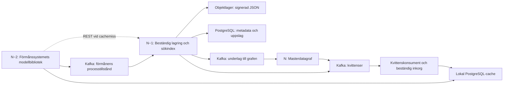

# Processpersistens och leverans till masterdata

## Syfte och slutsats

Detta underlag sammanfattar diskussionen om PoC:ens persistens och det
efterföljande masterdataflödet. Det beskriver arkitekturen och den fortsatta inriktningen. Den lokala
implementation som därefter tillkommit sammanfattas i avsnittet om PoC:ens nuläge.

Förmånssystemet ska arbeta med verksamhetslogik på Java-objekt enligt
organisationens informationsmodell. Modellbiblioteket och dess infrastruktur
ska hantera serialisering, ändringsdetektion, versionsnummer, signering,
validering, migrering och persistens. Migrering av äldre dokument sker före
deserialisering till Java-objekt, genom en serie versionssteg.

Förmånssystemets omedelbara behov är att kunna återuppta **sin egen process från
rätt tillstånd**. Det behöver inte invänta att samma tillstånd blivit tillgängligt
för andra förmånssystem i masterdatagrafen. En aktuell lokal kopia räcker för
återläsning, även om efterföljande bearbetning är fördröjd.

Den föreslagna inriktningen är att:

- göra det lokala processtillståndet beständigt före Kafka-commit;
- skilja strikt lagring från lagring som tillåter fortsatt arbete vid Kafka-fel;
- återförsöka en befintlig leverans med oförändrat id och innehåll;
- följa bekräftade milstolpar genom kedjan utan att exponera dem som villkor för
  vanlig verksamhetslogik;
- använda objektversion för val av aktuellt tillstånd, inte ankomsttid.

## Kedjans tre steg

Pilarna visar ansvar och dataflöde. Commit-ordningen beskrivs separat nedan.
Objektlagret och dess sökindex är den beständiga källan för råa processtillstånd.
Grafen är den representation som övriga konsumenter använder. Den lokala cachen
är normalt en snabb återläsningsväg, men vid leveransstörningar kan den under en
period vara den enda beständiga kopian av ett nytt processtillstånd.

## Identiteter, versioner och data

| Egenskap | Betydelse |
| --- | --- |
| Korrelations-id | Processinstansens identitet. Flera leveranser kan tillhöra samma process. |
| Objekt-id | Domänobjektets beständiga identitet. |
| Objektversion | Innehållets version inom objektets identitet. Höjs vid relevant ändring. |
| Dataleverans-id | En leverans identitet, tilldelad som UUID version 7 i demon. |
| Signatur | Gör det möjligt att verifiera JSON-dokumentet; är inte en unik leveransnyckel. |
| Tidsstämplar | Underlag för spårning och driftanalys. |

Två invarianter behöver hållas isär:

1. **Samma dataleverans-id ska alltid avse samma leveransdata.** Återförsök får
   inte ändra JSON, signatur eller ursprungliga identitetsmetadata.
2. **Samma objekt-id och objektversion ska alltid avse samma innehåll.** Annars
   kan en versionskontroll inte avgöra vilket av två motstridiga tillstånd som
   är det riktiga.

Ett nytt lagringsanrop kan ge ett nytt dataleverans-id trots oförändrat
verksamhetsinnehåll och oförändrad objektversion. Det är acceptabelt. Ett
återförsök av en redan skapad leverans behåller däremot dess dataleverans-id.

JSON behandlas som ett opakt dokument i lagringsadaptrarna. Transportmetadata
kan följa med i Kafka-headers och objektlagrets metadata, utan att dokumentet
packas om. I nuvarande PoC skyddar signaturen själva JSON-dokumentet, inte
Kafka-headers. Därför måste även tilliten till metadata och deras koppling till
dokumentet ingå i integrationskontraktet.

## Steg N−2: Lagra och återläsa förmånens process

### Ansvar

Vid lagring tar modellbiblioteket emot en Java-objektgraf och korrelations-id.
Det upptäcker ändringar, hanterar objektversionen, serialiserar och signerar
dokumentet samt skapar leveransidentiteten. Förmånssystemet behöver inte hantera
JSON eller själv spara dataleverans-id i en egen databas.

Lokal PostgreSQL använder dataleverans-id som primärnyckel. Korrelations-id är
sökbart men inte unikt. Dokument, signatur, objektversion, tidsstämplar och
leveransstatus lagras tillsammans.

### Diskuterade alternativ

| Alternativ | Villkor för framgång | Återläsning och återhämtning |
| --- | --- | --- |
| a: Endast Kafka | Bekräftad Kafka-publicering. Ingen lokal kopia krävs. | Läs via backendens REST-gränssnitt. Backend kan ännu vara upptagen med leveransen. |
| b: Kafka och lokal cache | Både lokal lagring och Kafka-publicering ska lyckas. | Läs lokalt när rätt tillstånd finns, annars via backend. Delvis lyckade operationer måste återhämtas. |
| c: Lokal resiliens | Lokal lagring räcker när Kafka inte fungerar. | Läs det nya tillståndet lokalt och återförsök publiceringen. |
| d: Avbryt arbetet | Det begärda lagringsvillkoret kan inte uppfyllas. | Returnera fel och pausa processen; skilj säkert misslyckande från osäkert eller delvis lyckat utfall. |

Alternativ d är ett felutfall för vald policy, snarare än en separat
lagringsmekanism. Ett lyckat Kafka-anrop är inte heller ett besked om att REST
redan kan läsa leveransen från steg N−1. Detta är relevant för alternativ a,
men inte när korrekt processtillstånd redan finns lokalt.

### Implementerad commit-ordning för strikt läge

PoC:en använder en yttre Kafka-transaktion och en inre PostgreSQL-transaktion i denna ordning:

1. Öppna PostgreSQL-transaktionen, lås processen och objektet samt kontrollera
   den förväntade versionen och eventuella väntande leveranser.
2. Börja Kafka-transaktionen som omsluter publiceringen och den lokala committen.
3. Skicka leveransen inom Kafka-transaktionen.
4. Skriv leveransen lokalt med status att publicering ännu inte är bekräftad.
5. Committa PostgreSQL.
6. Committa Kafka.
7. Registrera bekräftad Kafka-publicering i en ny lokal databastransaktion.
8. Returnera framgång när de två lagringarna är bekräftade. Om enbart
  statusuppdateringen misslyckas får den återhämtas; leveransdata är då redan
  lagrade i båda systemen.

PostgreSQL-commit släpper transaktionslåsen före Kafka-commit. Den beständiga
väntande raden måste därför hindra andra skribenter från att passera en
olöst leverans i strikt läge. Ett lås under enbart den första databastransaktionen
räcker inte för att samordna hela förloppet. Den nya implementationen håller
sessionslås på en egen fysisk databasanslutning över båda commitstegen och
behåller den väntande raden som spärr efter ett avbrott.

Detta är **inte en gemensam atomisk transaktion**. Kafka kan inte rulla tillbaka
en redan committad PostgreSQL-transaktion. Däremot förhindrar ordningen att
Kafka avsiktligt committas innan den lokala kopian är beständig. Konsumenterna
måste läsa med `read_committed` för att bara se committade Kafka-transaktioner.
[Apache Kafka: transaktioner och leveranssemantik](https://kafka.apache.org/41/design/design/)

| Avbrott | Beständigt resultat | Hantering |
| --- | --- | --- |
| Lokal lagring misslyckas före commit | Ingen ny lokal kopia; Kafka ska aborteras. | Returnera fel. Kontrollera osäkra commit-utfall vid behov. |
| PostgreSQL har committats men Kafka aborterar | Lokal leverans finns; ingen bekräftad Kafka-publicering. | Behåll leveransen och återförsök. |
| PostgreSQL har committats och processen kraschar före Kafka-commit | Lokal leverans finns; Kafka-utfallet behöver återhämtas. | Återställ producentens transaktionshantering och publicera vid behov. |
| Kafka har committats men kvittot eller lokal statusuppdatering uteblir | Leveransen kan redan finnas i båda systemen. | Sök positiv bekräftelse eller återförsök samma leverans. |

En timeout vid Kafka-commit är inte ett säkert besked om att commit misslyckats.
För en fortfarande fungerande producent måste återhämtningen följa klientens
regler för att återförsöka commit; ett godtyckligt abort-anrop är inte alltid
tillåtet när commit kan vara på väg att slutföras.
[KafkaProducer: commit och felhantering](https://kafka.apache.org/41/javadoc/org/apache/kafka/clients/producer/KafkaProducer.html)

Strikt och resilient läge kan använda samma beständiga underlag för
återhämtning. Skillnaden är när verksamhetsprocessen får fortsätta:

- I strikt läge krävs bekräftad lokal lagring och Kafka-publicering. Ett delvis
  lyckat eller osäkert resultat pausar normal fortsättning tills utfallet är
  löst. Den nya lokala versionen ska inte förkastas eller ersättas av en äldre.
- I resilient läge får processen fortsätta efter lokal commit även om Kafka
  återstår. Detta är ett medvetet accepterat driftläge vid infrastrukturfel.

Även när förmånen inte har en egen databas behöver återhämtningsmaskineriet
beständigt kunna koppla processen till dess väntande leverans och version.

## Steg N−1: Rådata i objektlager och sökbart metadataindex

Steget konsumerar leveranser från Kafka och lagrar JSON med det ursprungliga
dataleverans-id som nyckel. PostgreSQL möjliggör uppslag med korrelations-id
och val av relevant dataleverans. PoC:ens REST-gränssnitt erbjuder hämtning per
leverans-id och senaste tillstånd per korrelations-id eller objekt-id, samt
separata metadatauppslag. Dokumentsvar innehåller original-JSON och
leveransmetadata i HTTP-headers.

**Först när både rätt objekt och rätt metadata är beständigt lagrade får steget
committa vidareleveransen till grafens topic.** Den konsumerade Kafka-offseten
och vidareleveransen samt rådatakvittot ingår i samma Kafka-transaktion. Då kan inte en
committad offset utan motsvarande vidareleverans orsakas av ett vanligt avbrott
mellan dessa två Kafka-operationer.

PostgreSQL-transaktionen och objektlagringen ingår fortfarande inte i Kafka-
transaktionen. Om extern lagring lyckas men Kafka-commit uteblir kommer
leveransen att behandlas igen. Externa skrivningar behöver därför tåla
upprepning. [Apache Kafka: gränsen mot externa system](https://kafka.apache.org/41/design/design/)

Det går att skriva metadata före objektet eller objektet före metadata. Oavsett
ordning gäller följande:

- En indexrad ensam bevisar inte att JSON finns i objektlagret.
- Ett objekt ensamt bevisar inte att uppslag med korrelations-id fungerar.
- En befintlig nyckel får räknas som framgång bara om den hör till rätt data.
- Ett generellt skrivfel får inte behandlas som en accepterad dublett utan
  kontroll av det beständiga resultatet.
- Samma leverans-id med motstridiga data ska avvisas och utredas.

Om olika skribenter använder olika första lagringspunkter samtidigt kan
motstridiga leveranser binda samma id till olika data i de två lagren. Därför
behövs ett gemensamt kontrakt för identitetsbindning och skrivordning, särskilt
vid övergång mellan implementationer. Oförändrade återförsök skapar inte i sig
denna konflikt.

En REST-bekräftelse för milstolpen ”rådata beständigt lagrade” ska avse båda
lagren. Ett uppslag som bara visar indexraden ger inte den garantin.

## Steg N: Projektion till masterdatagraf

Steget läser JSON från sin Kafka-topic och skriver den organisatoriska modellen
till grafen. JSON-LD-expansion är en möjlig framtida utvidgning; den körbara
PoC:en använder den centrala grafmappningen och har ingen generell expansion.

En fördröjd äldre version ska inte skriva över en nyare version. Kontroll av
lagrad version och ändring av grafen måste ske atomiskt, även om flera
konsumenter eller återförsök arbetar samtidigt. Kvittering av den konsumerade
offseten får inte ske före beständig grafhantering; ett avbrott efter grafcommit
men före offsetcommit kan då ge en ofarlig upprepning. I PoC:en committas
grafkvittot och den konsumerade offseten i samma Kafka-transaktion efter
Neo4j-commit.

Grafsteget kan slutföra en leverans på flera sätt:

- tillämpa en nyare version;
- konstatera att samma version redan har tillämpats;
- konstatera att en senare version redan finns och lämna grafen oförändrad.

Det sista fallet är inte ett leveransfel. Därför är ”grafbehandlad” en bättre
milstolpe än ”synlig i masterdata” för en enskild historisk leverans. En version
som blivit ersatt behöver inte längre vara synlig som aktuellt tillstånd.

Principen att samma data ger samma graf förutsätter också en kontrollerad
projektion och JSON-LD-kontext. En förändrad tolkningskontext är en separat
versions- och omprojekteringsfråga; identiska JSON-bytes behöver inte automatiskt
ge samma graf under olika tolkningar.

## Gemensam modell för leveransens framsteg

Leveransstatus är infrastrukturinformation per dataleverans-id, skild från
objektets verksamhetsversion. Följande milstolpar är implementerade:

| Bekräftad milstolpe | Vad vi vet |
| --- | --- |
| Lokalt lagrad | Dokument och metadata är beständiga lokalt. Tillståndet kan återläsas och leveransen återförsökas. |
| Publicerad till Kafka | Kafka-commit är bekräftad. Backend kan ännu bearbeta leveransen. |
| Rådata beständigt lagrade | Objektlager och sökbart metadataindex innehåller rätt leverans. |
| Grafbehandlad | Grafsteget har slutfört hanteringen, med tillämpad, redan tillämpad eller ersatt version som möjligt resultat. |

Modellen bör lagra bekräftelser, exempelvis med observerad tid och källa, snarare
än enbart ett fält som påstås beskriva exakt var data befinner sig. Framsteg i
denna kedja är ordnade, men lokala observationer kan komma sent eller i annan
ordning. Senare bekräftelser får inte skrivas över av äldre besked.

En bekräftelse från ett senare steg kan fastställa tidigare passage genom
Kafka, enligt det överenskomna protokollet. Den bevisar däremot inte i sig att
en lokal kopia fortfarande finns; lokal existens är också en separat egenskap
om cachen kan gallras.

Återhämtningen kan inhämta bekräftelser genom:

- upprepade REST-uppslag efter dataleverans-id i steg N−1;
- en separat observerande konsument på topicen som matar steg N, med
  `read_committed` och egen konsumentgrupp;
- ett särskilt kvitto eller ett uppslag från grafsteget för slutförd
  grafbehandling.

Observation av grafens indatatopic bekräftar enligt protokollet lagring i N−1
och vidarepublicering, **inte att grafen redan har behandlat meddelandet**.
Avsaknad av observation bevisar inte misslyckande: leveransen eller kvittot kan
vara fördröjt. För historiska uppslag behöver REST eller beständiga kvitton
fungera även när topicens retention inte längre medger observation.

### Implementerad återkoppling i PoC:en

Rådata- och grafsteget publicerar på `<ursprungstopic>.kvitton`, med
korrelations-id som Kafka-nyckel. Kvittot identifierar ursprungstopic,
dataleverans-id, korrelations-id och slutfört steg. Ett SHA-256-fingeravtryck
binder kvittot till hela leveransen, inklusive original-JSON, signatur,
versioner och ursprunglig tid. Avsändartiden används inte för versionsordning.

`Kvittenskonsument` läser med `read_committed` och sparar kvittot i den lokala
PostgreSQL-inkorgen `ffa_kvittens`. En befintlig cachepost verifieras och dess
milstolpar uppdateras i samma SQL-transaktion. Först därefter committas
Kafka-offseten. En krasch mellan dessa commits ger en säker återleverans.
Kvitton för saknade cacheposter sparas och stäms av vid dokumentåterställning.
Dubletter och omvänd kvittensordning kan inte sänka en bekräftad milstolpe.

REST:s metadatauppslag läser endast indexet. Verifierad dokumentåterläsning
kräver däremot rätt data i båda backendlagren och kan bekräfta rådatalagring.
Endast HTTP 404 behandlas som saknat tillstånd; transport- och verifieringsfel
får inte döljas som cachemiss. Kärnan verifierar dokumentet före migrering och
Java-bindning samt återställning till cachen.

En stabil konsumentgrupp behövs per logisk cache. Repliker med samma databas
kan dela grupp; olika cache-databaser behöver egna grupper. Felaktiga kvitton
stoppar sin partition utan offsetcommit och kräver utredning. Retention,
inkorgsgallring och operativ felhantering behöver ett produktionskontrakt.
Fingeravtrycket autentiserar inte avsändaren: Kafka-ACL måste begränsa vilka
komponenter som får ge positiva kvitton. PoC:ens REST lyssnar på loopback;
produktion behöver även ett behörighets- och TLS-kontrakt.

Endpoint- och kvittensformat samt körinstruktioner finns i
[pipeline-dokumentationen](../docs/pipeline.md).

## Version är något annat än ankomstordning

Fördröjda leveranser och dubletter accepteras i kedjan. Därför ska aktuellt
processtillstånd väljas utifrån objektversion inom rätt objektidentitet, inte
enbart senaste ankomst eller lagringstid. Vid lika version kan en lokal
ordningsnyckel ge ett entydigt val mellan likvärdiga leveranser.

Tidsstämplar från en gemensam databas undviker skillnader mellan producenternas
klockor, men definierar inte automatiskt commit-ordning. PostgreSQLs `now()`
avser transaktionens start, medan `clock_timestamp()` avser tiden när uttrycket
utvärderas. En sekvens ger unika tilldelade värden men inte generell
commit-ordning mellan samtidiga transaktioner.
[PostgreSQL: tidsfunktioner](https://www.postgresql.org/docs/current/functions-datetime.html),
[PostgreSQL: sekvenser](https://www.postgresql.org/docs/current/functions-sequence.html)

Exempel: version 2 anländer först och version 1 anländer senare. Den senare
ankomsten ändrar inte vilket verksamhetstillstånd som är nyast. UUID version 7
eller perfekt synkroniserade klockor ändrar inte detta.

”Rådata beständigt lagrade” bekräftar dessutom en viss leverans, inte att den
är processens senaste. Val av processtillstånd och uppföljning av leveransen
ska därför vara separata mekanismer.

## Konsistensfrågan som identifierades i PoC:en

Den tidigare strikta adaptern inväntade Kafka-kvitto före den lokala skrivningen.
Om Kafka lyckas men lokal INSERT eller commit misslyckas kan backend få version
2 samtidigt som cachen fortfarande innehåller version 1. Fallback läser
backend bara vid cachemiss; den upptäcker alltså inte automatiskt att en
befintlig cacherad är inaktuell.

Det ursprungliga integrationstestet visade att ett sådant förlopp kunde publicera
versionerna 1, 2, 1. Den äldre leveransen i sig skadar inte en versionsskyddad graf.
Problemet uppstår om verksamheten fortsätter från det gamla tillståndet:
nästa ändring kan återanvända version 2 för annat innehåll. Det nuvarande
integrationstestet kontrollerar att version 2 i stället finns kvar lokalt, att
strikt fortsättning pausas och att nästa ändring efter återhämtning får version 3.
Den ursprungliga regressionen accepteras alltså inte längre.

Detta är en fråga om korrekt återupptagning och versionshantering, inte ett
påstående om att Kafka tappar levererade data. Den implementerade commit-ordningen
flyttar det centrala avbrottsfallet till ”ny version finns lokalt, men
publiceringen är inte bekräftad”. Där finns ett beständigt underlag att återhämta.

## Vad som finns och vad som återstår

PoC:en har redan signerade leveranser med UUID version 7, lokal PostgreSQL-cache,
Kafka-publicering, versionskontroll, ett resilient återförsöksläge och ett
anslutningsbart läskontrakt för backend. Grafprojektionen skyddar mot äldre
versioner och upprepningar. Det finns ingen anslutning till företagets verkliga
REST-backend i denna utvecklingsmiljö.

Den nya strikta commit-ordningen, processpausen och beständiga leveransmilstolpar
är nu implementerade lokalt. TLA+-modellen följer också rådatalagring,
grafbehandling och fördröjda positiva bekräftelser. Den tidigare strikta
versionsregressionen är nu en positiv kontroll av det förstärkta protokollet.

En valfri modul, `ffa-pipeline`, kör hela kedjan mot Kafka, PostgreSQL, RustFS
och Neo4j. Backend skriver objekt först och index därefter, innan vidareleverans
och källoffset committas i Kafka. Förmånens verksamhetskod behöver fortfarande
inte dessa infrastrukturbibliotek. Ett lokalt REST-gränssnitt exponerar index-
uppslag och verifierad dokumentåterläsning. Rådata- och grafsteget publicerar
kvitton på en separat förmånstopic, transaktionellt med konsumerade offsets.
En konsument lagrar kvittona beständigt och uppdaterar lokal cache. Kvitton för
saknade cacheposter bevaras till återställning; indexuppslag ensamt är inte
bevis för att både objekt och index finns. Produktionskontrakt, behörighet och
retention behöver fortfarande fastställas.

[Hela-kedjan-dokumentationen](../docs/pipeline.md) beskriver körning och
inspektion. TLA+-modeller och riktiga integrationstester kompletterar varandra,
men bevisar inte hela produktionskedjan. TLA+-leveransmodellen abstraherar
kvittenser till positiva observationer. En kompletterande kvittensmodell följer
nu topic, SQL-inkorg, offsetcommit, cacheförlust och återställning uttryckligen,
med en innehållstoken fristående från objektversion. Fyra negativa kontroller
visar varför commit-ordning, grafbevis, inkorgsavstämning och innehållskontroll
krävs. Modellerna är inte mekaniskt sammansatta; samma gränser testas också i
den körbara kedjan.

Följande behöver fortsatt granskas inför en produktionslösning:

1. Gemensam återhämtningsmekanism med strikt respektive resilient villkor för
   processens fortsättning.
2. Kafka-transaktioner och lokal commit-ordning, inklusive avbrott vid varje
   commit- och kvittogräns.
3. Ett versionskontrakt som hindrar konkurrerande eller återhämtade processer
   från att skapa olika innehåll med samma objektversion.
4. Backendens kontrakt för identitetsbindning, dubletter, direktleveransuppslag
   och val av senaste tillstånd via korrelations-id.
5. Beständiga milstolpar och hur positiva bekräftelser samlas in utan att
   förmånssystemet behöver vänta på grafen.
6. Utvidgade modeller och integrationstester för det sammansatta protokollet,
   särskilt osäkra commit-utfall, omstarter och fördröjda bekräftelser.

Kafka är central för beständig transport och återleverans. Den operativa
garantin beror också på bland annat replikering, kvittenser, retention,
konsumenternas offsethantering och återhämtningsrutiner. Målet är att varje
bekräftat processtillstånd har ett beständigt återhämtningsunderlag, och att
inget steg tappar ansvaret för leveransen innan nästa steg säkert kan ta över.

## Hänvisningar till projektet

- [Nuvarande persistens och återhämtning](../docs/persistens.md)
- [TLA+-modell för leverans och lokal cache](../spec/delivery/README.md)
- [TLA+-modell för objektlager och metadataindex](../spec/backend/README.md)
- [Integrationstest för strikt återhämtning, versionsskydd och lokala skrivfel](../ffa-persistence/src/test/java/se/fk/mimer/persistence/PostgresKafkaIntegrationTest.java)

- [REST, kvittenser och hela kedjan](../docs/pipeline.md)
- [Integrationstester för REST och kvittenskonsumenten](../ffa-pipeline/src/test/java/se/fk/mimer/pipeline/PipelineIntegrationTest.java)

Underlaget sammanfattar diskussionen den 3 oktober 2026. Det kan användas som
arkitekturunderlag för teamets beslut om nästa utvecklingssteg i PoC:en.
